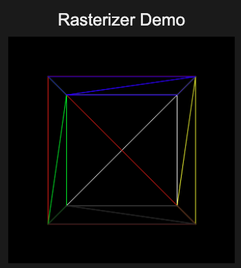

# Graphic renders in js

A personal deep dive into the foundations of computer graphics

## About the Project

The goal of this project was to deeply understand the fundamentals of rendering by building everything manually — without relying on any graphics engines or abstraction layers.

The only external tool used was a math library for vector operations. Everything else, including the rendering pipelines, lighting, camera logic, and scene handling, was implemented from scratch.

## What I Built

### Ray Tracer

A physically-inspired rendering system that simulates light paths to produce realistic images. It handles:

- Ray-object intersections
- Basic lighting models
- Reflection and shading logic
- Camera ray generation

### Rasterizer

A real-time rendering pipeline that converts 3D geometry into pixels. It includes:

- Triangle projection and rasterization
- Barycentric coordinate calculations
- Depth handling

## Demo

You can try the live version of the project here:

**Live Demo:** https://your-demo-link-here.com

## Results

Below are some example outputs generated by the ray tracer and rasterizer.

